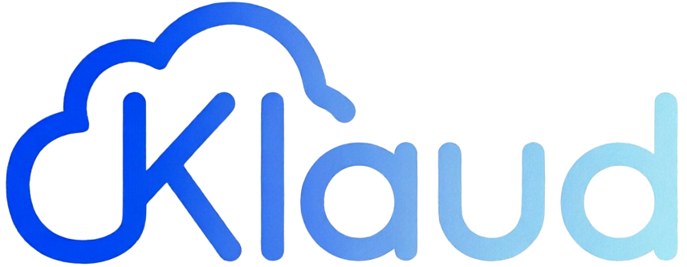

  

**Klaud** (from German *Wolke* — cloud) is a decentralized, serverless file sync app
for Android. Files are synchronized peer-to-peer directly between devices — no cloud,
no server, no IP exposure. All traffic runs exclusively over the **Tor network** via
.onion addresses.

---

## ✨ Features

- 🧅 **Tor Hidden Services** — All connections run exclusively over `.onion` addresses
- 🔐 **End-to-End Encryption** — AES-256-GCM with a random IV per frame
- 🛡️ **Post-Quantum Handshake** — ML-KEM (Kyber) via BouncyCastle
- 📡 **Peer Exchange** — Automatic mesh network discovery of new devices
- 📷 **QR Code Pairing** — Devices paired by scanning onion address + public key hash
- 🔁 **Real-Time Sync** — File changes detected instantly via `FileObserver`
- 🗑️ **Deletion Propagation** — Deletions synced to all peers (queued for offline ones)
- ⏰ **Scheduled Sync** — Periodic background sync via WorkManager (hourly to weekly)
- ✅ **SHA-256 Deduplication** — Files only transferred if actually changed
- 📬 **Offline Queue** — Persistent delivery queue, flushed automatically on reconnect
- 💾 **Storage Awareness** — Free/used/total storage shown in Settings; incoming
  transfers are blocked when space is insufficient
- 📁 **File Manager Integration** — Browse and open Klaud files from any Android file
  picker or file manager via the Storage Access Framework (like Nextcloud or Google Drive)
- 🌄 **Image Preview** — Pinch-to-zoom viewer with ViewPager2

---

## 🔒 Security Model

1. **No server** — Direct device-to-device via Tor, no central point of failure
2. **No DNS leaks** — All connections go through the Tor SOCKS proxy exclusively
3. **Post-quantum secure** — ML-KEM (Kyber) protects against future quantum attacks
4. **Authentication** — Peer public key hash verified during QR pairing
5. **Integrity** — SHA-256 of every file verified on sender and receiver side

---

## 📁 File Manager Integration

Klaud registers as a **DocumentsProvider** via Android's Storage Access Framework.
This means:

- Klaud appears in the Android Files app alongside Google Drive, Nextcloud etc.
- Any app using a file picker (`ACTION_OPEN_DOCUMENT`) can access Klaud files
- Files created or deleted via the file manager are automatically synced to peers

---

## 📱 Requirements

- Android 10+ (API 29)
- No root required
- Tor bundled as native binary (arm64-v8a, armeabi-v7a)

---

## 📄 License

MIT License — see [LICENSE](LICENSE)
